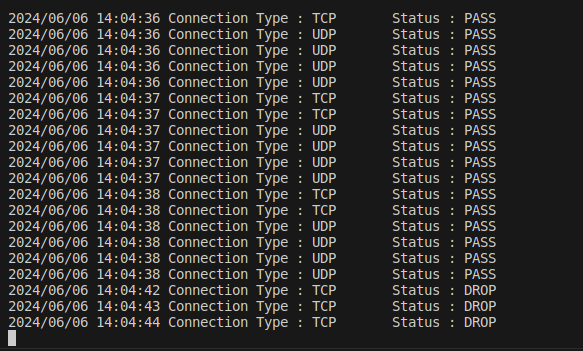

# This repo consists the solution of the assignment by Accuknox

The repo is divided in 3 folder each representing a problem statement of the assignment
**ps1** - Problem Statement 1
**ps2** - Problem Statement 2
**ps3** - Problem Statement 3

### Probelm Statement 1
   
   > Write an eBPF code to drop the TCP packets on a port (def: 4040). Additionally, if you can make the port number configurable from the userspace, that will be a big plus. 
   
   ##### solution consists of a BPF program in the [BPF](/ps1/BPF) directory.
   The program uses the XDP network module hook to filter network packet.
   Packet coming to the specified port (default :4040) in user space are droped.
   The program uses bpf_ringbuf_map to send events from kernel space to user space.
   
   ## steps to start the program

#### 1. Go to the ps1 directory and build the program

```sh
    cd ps1
    make build
```

#### 2. Run the program

```sh
    make start
```

### 3. Send network request from postman

    Send some http request to the blocked port and you will see the logs of the packets being dropped.
    Try sending request to some other port and obserb that the request was not blocked !

## You should be able to see the logs of all the network packet protocol and if the packets where droped 

